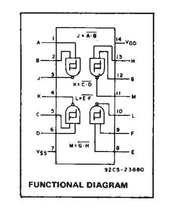
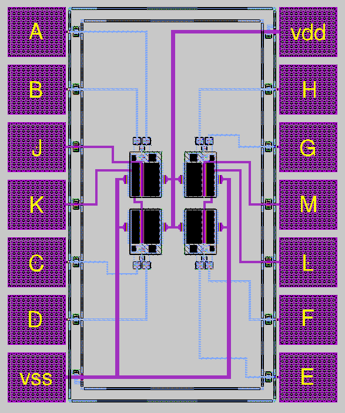

# CD4093B TSMC 180nm 1P6M 1.8V
Copy of a CD4093B integrated circuit (4 2-Input NAND Schmitt Triggers) made in TSMC 180 nm 1P6M 1.8V technology. Designed as a university project using LTspice and Magic VLSI.

Detailed presentation and simulation results are in the pdf file in folder docs.

## Images
Functional diagram

Full chip layout

Single Gate layout

